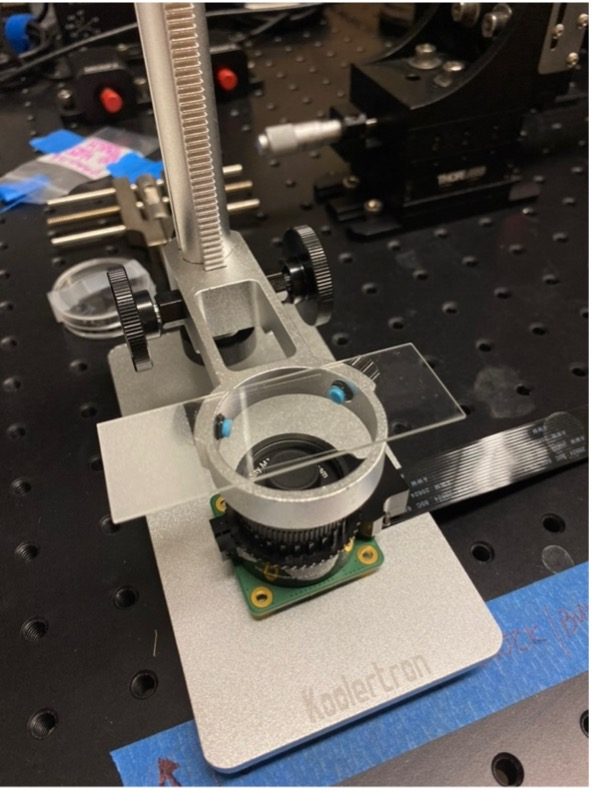

# ISpeed-Microscopy

## Welcome!

Welcome to the **ISpeed-Microscopy** repository! Here, you will find everything you need to build your own **ISpeed Microscope**, a small, portable, and affordable device that allows you to explore the microscopic world around you.

This project is designed for students in the **Immersive Summer Program for Education, Enrichment, and Distinction (ISPEED) in Biomedical Engineering**. It is especially suited for high-school learners who are curious about engineering, optics, imaging, and biomedical science.
Below is a picture of the completed microscope:

This project is designed to be accessible, especially for young enthusiasts and educational purposes. With a Raspberry Pi, a camera module, a simple lens setup, and some careful focusing, you can begin observing tiny structures that are usually invisible to the naked eye.

Check out some example images captured using the ISpeed Microscope:

 

## Build Instructions

To get started, follow these simple steps:

1. **Gather Materials**  
   Refer to the parts list included in this repository for all the components you will need.

2. **Assembly**  
   Follow the detailed setup instructions provided in the instruction manual to assemble your microscope.

3. **Set Up the Raspberry Pi**  
   Connect your Raspberry Pi to a monitor, keyboard, and mouse, then power it on. Follow the manual to check the camera and run the preview.

4. **Start Exploring**  
   Place a sample on the microscope stage, adjust the focus, and begin imaging. Try everyday samples such as paper, fabric fibers, leaves, or prepared microscope slides.

 

## Files Included

This repository includes:

- `ISPEED Microscopy Kit Setup.pdf`  
  Step-by-step instructions for setting up the Raspberry Pi, assembling the microscope, previewing the camera feed, and capturing images.

- `Parts List.xlsx`  
  A list of parts needed to build the microscope.

- `Images/`  
  Example images and figures used in this repository.

 

## Need Help or Want to Share Your Discoveries?

If you encounter any issues while building your microscope or if you want to share the amazing images you've captured, don't hesitate to reach out. You can email me at `sali79[at]jhu.edu`.

## Happy Exploring, Microscopists!
